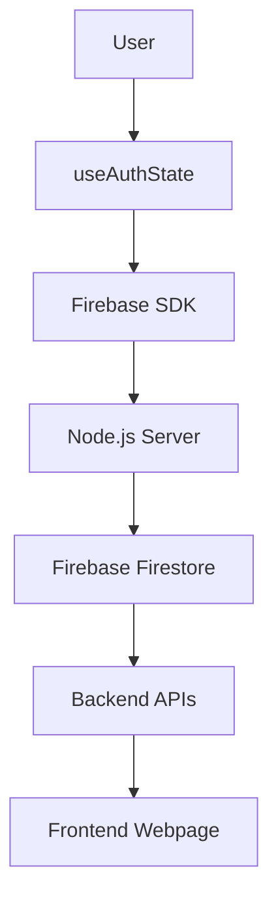

```mermaid
graph TD
    A[User] --> B[useAuthState]
    B --> C[Firebase SDK]
    C --> D[Node.js Server]
    D --> E[Firebase Firestore]
    E --> F[Backend APIs]
    F --> G[Frontend Webpage]
```

